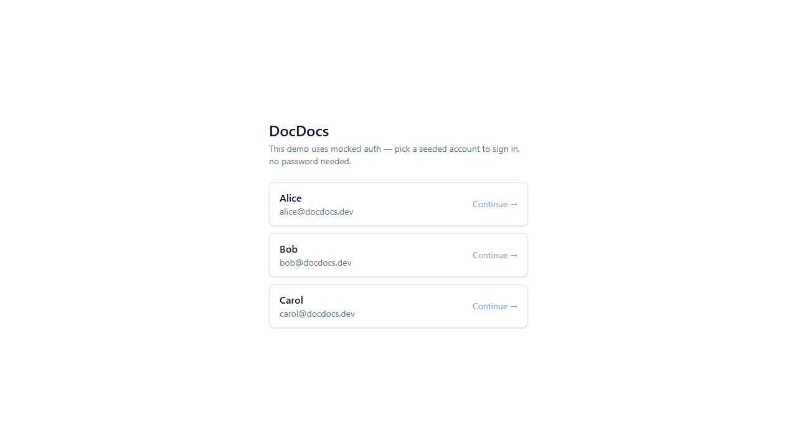
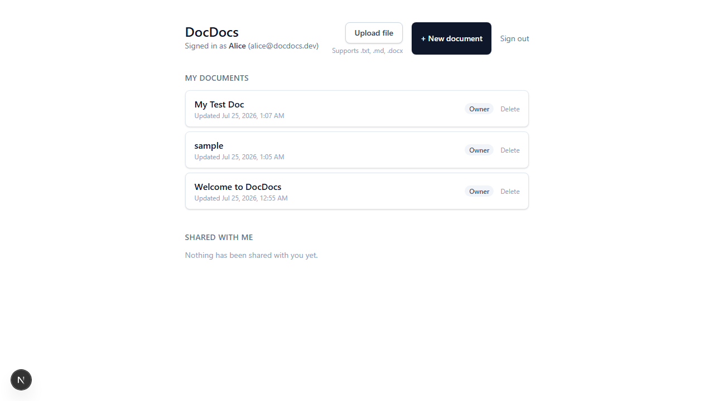
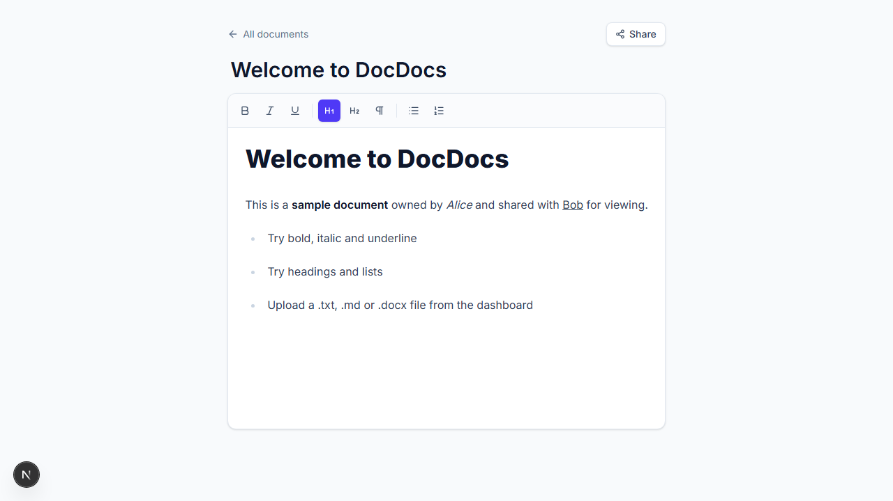
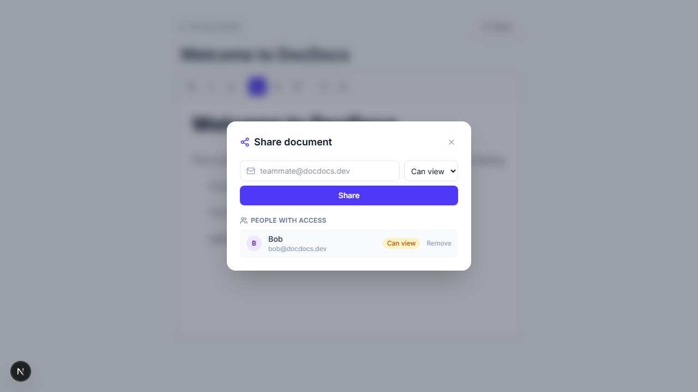
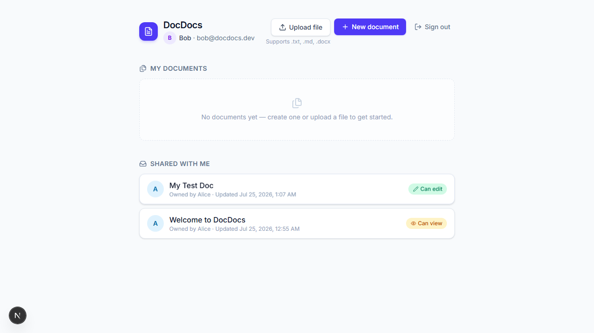
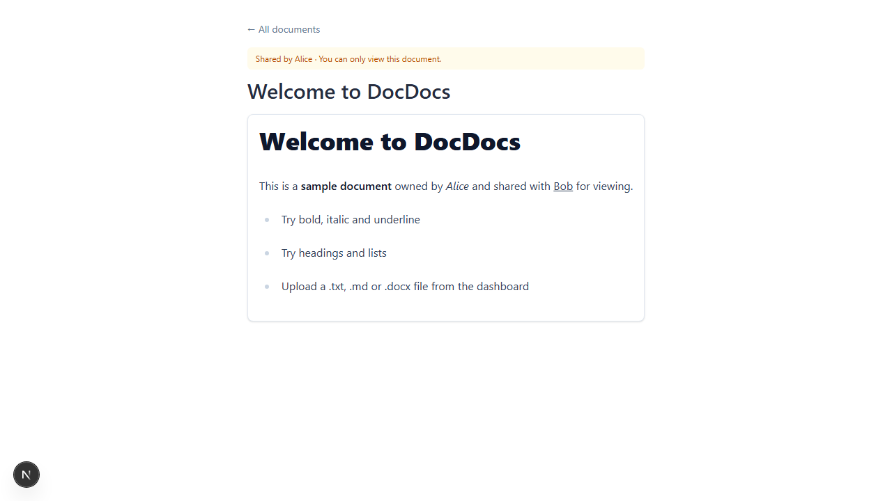

# DocDocs — a lightweight collaborative document editor

A small Google-Docs-style app: create and format documents, import files,
share them with other (seeded) users, and pick up right where you left off
after a refresh. Built with Next.js (App Router), Prisma, Postgres, and
Tiptap.

**Live deployment:** https://fullstack-seven-roan.vercel.app
**Source code:** https://github.com/salman122Arshad/fullstack

## Try it now (no setup)

The live deployment uses **mocked auth** — there are no passwords. The login
screen lists three seeded accounts:

| Name  | Email               |
|-------|---------------------|
| Alice | alice@docdocs.dev   |
| Bob   | bob@docdocs.dev     |
| Carol | carol@docdocs.dev   |

Click a name to sign in as that user. A good way to see the sharing model:
log in as **Alice**, open "Welcome to DocDocs" (owned by Alice), click
**Share**, sign out, sign back in as **Bob** — you'll see it under "Shared
with me" with the permission Alice granted.

## Features

- **Rich-text editing** — bold, italic, underline, H1/H2/paragraph, bulleted
  and numbered lists (via [Tiptap](https://tiptap.dev)). Autosaves ~700ms
  after you stop typing; title renames save on blur/Enter.
- **File import** — upload a **.txt, .md, or .docx** file from the dashboard
  and it becomes a new editable document (5MB max). Any other file type is
  rejected with a clear error, client- and server-side.
- **Sharing** — a document owner can grant another (seeded) user **view** or
  **edit** access by email, and revoke it later. The dashboard visually
  separates "My documents" from "Shared with me", with a permission badge on
  shared items.
- **Persistence** — everything is stored in Postgres via Prisma; content,
  titles, and sharing all survive a refresh or a new login session.

## Tech stack

- **Next.js 16** (App Router, TypeScript) — one deployable surface; API
  routes double as the backend.
- **Prisma ORM** + **Postgres** (Supabase in production, Docker locally).
- **Tiptap** (ProseMirror) for the editor; content is stored as HTML.
- **Zod** for API input validation.
- **Tailwind CSS v4** for styling.
- **Vitest** for unit tests.
- Mocked auth: a signed (HMAC) session cookie naming a seeded user id — no
  passwords, per the assignment's allowance for seeded/mocked accounts.

## Local setup

Prerequisites: Node 20+, npm, and a local Postgres. The easiest path is
Docker (a `docker-compose.yml` is included); any Postgres instance works if
you'd rather point at one directly.

```bash
# 1. Install dependencies
npm install

# 2. Start a local Postgres (or point at your own — see .env below)
docker compose up -d

# 3. Configure environment variables
cp .env.example .env
# .env already has working defaults for the docker-compose Postgres above.

# 4. Create the schema and seed 3 test users + a sample shared document
npx prisma migrate dev
npm run db:seed

# 5. Run the app
npm run dev
```

Open http://localhost:3000 and log in as Alice, Bob, or Carol.

### Environment variables

See `.env.example`. Two names matter for Prisma:

- `DATABASE_POSTGRES_PRISMA_URL` — the connection Prisma Client uses at
  runtime (pooled, in production).
- `DATABASE_POSTGRES_URL_NON_POOLING` — used only by `prisma migrate`
  (schema changes need a direct, non-pooled connection).

These names were chosen to match what Vercel's Supabase Marketplace
integration auto-generates (with a `DATABASE` prefix), so the same schema
works unmodified locally and in production — see `ARCHITECTURE.md` for why.

- `AUTH_SECRET` — HMAC signing key for the mocked-auth session cookie. Any
  string locally; set a long random value in production.

### Tests

```bash
npm test
```

Covers the document-authorization rule (`canAccessDocument` in
`src/lib/access.ts`) — owner vs. view-share vs. edit-share vs. no-access —
since that function is what stands between "shared with me" and "everyone
can see everyone's documents."

### Build

```bash
npm run build
```

## Deployment

Deployed to **Vercel**, database on **Supabase Postgres** (free tier),
connected via Vercel's Storage → Supabase Marketplace integration (which
injects the `DATABASE_POSTGRES_*` variables automatically). No paid service
is required to run or review this project.

## Screenshots

| | |
|---|---|
| Login (seeded users) |  |
| Owner's dashboard |  |
| Editor + formatting toolbar |  |
| Share dialog |  |
| Recipient's dashboard (shared docs + permission badges) |  |
| View-only document (toolbar hidden) |  |

## Scope notes

- Supported file import types are intentionally limited to **.txt, .md, and
  .docx** (5MB max) — stated here and in the upload control's UI copy.
  `.docx` is converted via `mammoth`, which extracts text/basic formatting;
  complex Word layouts (tables, images, multi-column) are not guaranteed to
  round-trip.
- Sharing is two-tier (view / edit), not granular/field-level permissions.
- No real-time multi-cursor collaboration, comments, or version history —
  see `ARCHITECTURE.md` for what was deliberately cut and why.
